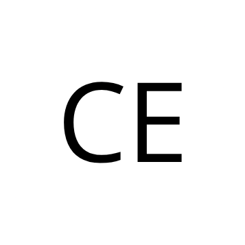

<div align="center">
  
</div>

domaine personnel
# cedrick.dev

# CID Folio

Personal portfolio of Cédrick Emmanuel, Web Developer.

## About

CID Folio is my personal portfolio where I showcase my projects, professional experience, technical skills and thoughts about web development, technology and my other interests.

## Built With

- Next.js
- React
- TypeScript
- Tailwind CSS

## Features

- About
- Work experience
- Projects
- Blog
- Thoughts

## Getting Started

Clone the repository:

```bash
git clone : HTTPS : https://github.com/cid-2003/cid-folio.git SSH : git@github.com:cid-2003/cid-folio.git

Install dependencies: pnpm install

Run the development server: pnpm dev

Open : http://localhost:3000


- **Icons**: [Lucide React](https://lucide.dev/icons/)
- **Framework**: [Next.js](https://nextjs.org/)
- **Deployment**: [Cloudflare Pages](https://pages.cloudflare.com/)
- **Syntax Highlight**: [Sugar High](https://github.com/huozhi/sugar-high)
- **Blog**: [Next MDX Remote](https://github.com/hashicorp/next-mdx-remote)
- **Styling**: [Tailwind CSS](https://tailwindcss.com/) & [shadcn/ui](https://ui.shadcn.com/)


